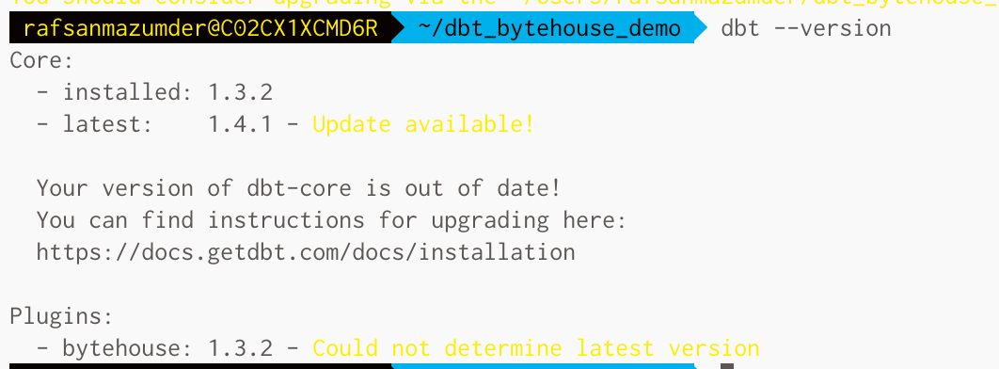
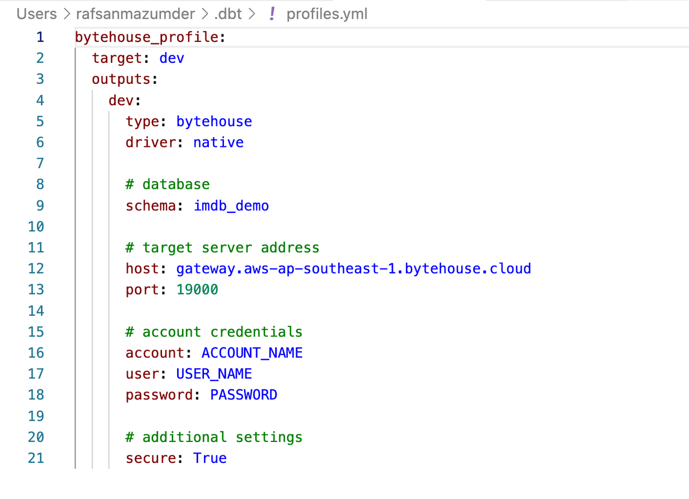
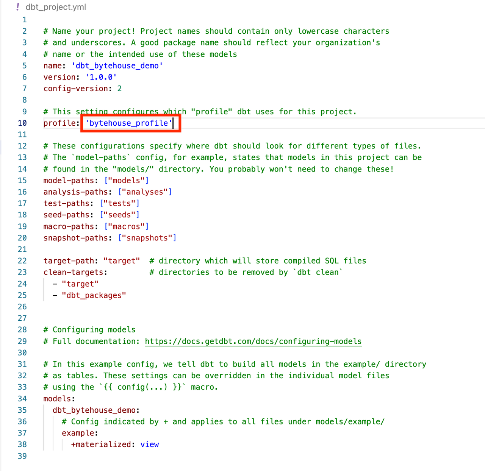
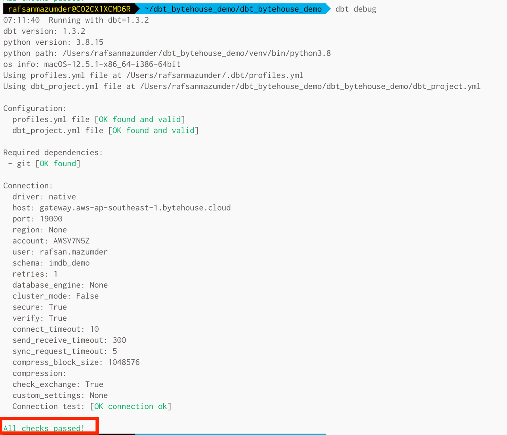
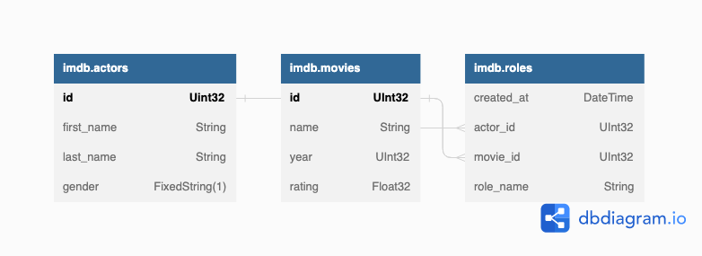
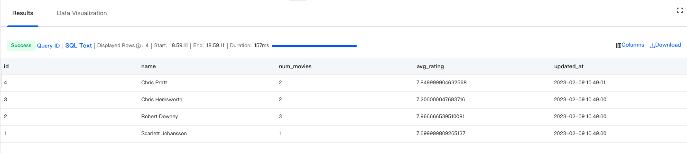
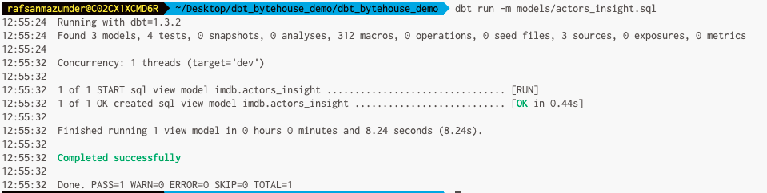
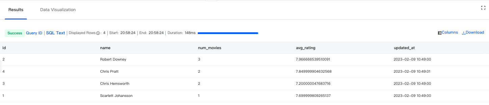
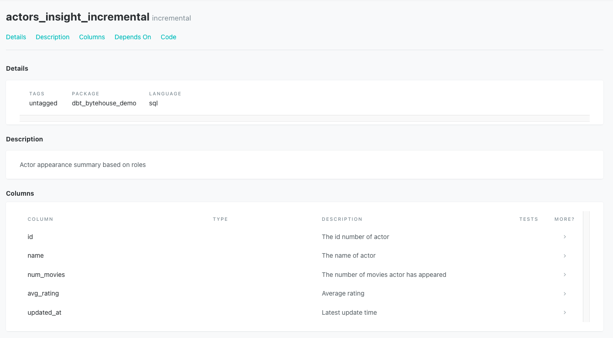

# Introduction
`dbt` (Data Building Tool) is an open source tool that enables data analysts and engineers to transform
data in their warehouses simply by writing select statements. `dbt` performs the T (Transform) of ETL and
allows companies to write transformations as queries and orchestrate them in a more efficient way. 
ByteHouse dbt connector is a plugin enabling users to build their data warehouse ecosystem with dbt 
and ByteHouse. 
# Table of Contents
- [Introduction](#introduction)
- [Requirements](#requirements)
- [Creating ByteHouse Account](#creating-bytehouse-account)
- [Installation](#installation)
- [dbt Project Setup](#dbt-project-setup)
  * [dbt_project.yml](#dbt-projectyml)
  * [profiles.yml](#profilesyml)
  * [Connection & Authentication Configurations](#connection---authentication-configurations)
    + [ByteHouse Regions](#bytehouse-regions)
    + [Region & Password Configuration](#region---password-configuration)
    + [Region & API Key Configuration](#region---api-key-configuration)
    + [Host Address & Password Configuration](#host-address---password-configuration)
    + [Host Address & API Key Configuration](#host-address---api-key-configuration)
  * [Project Initialization](#project-initialization)
  * [Test Warehouse Connection](#test-warehouse-connection)
- [Dataset Ingestion](#dataset-ingestion)
- [dbt Models](#dbt-models)
- [schema.yml](#schemayml)
- [Materialization types of Models](#materialization-types-of-models)
  * [View Materializations](#view-materializations)
  * [Table Materializations](#table-materializations)
  * [Incremental Materializations](#incremental-materializations)
    + [How it works](#how-it-works)
- [Project Documentation](#project-documentation)
- [Local Development](#local-development)
- [Original Author](#original-author)
- [License](#license)
# Requirements
Make sure you have `dbt` & `python` installed on your machine. If not, then you can follow this guide https://docs.getdbt.com/docs/get-started/installation
- dbt v1.3.0 or greater
- python v3.7 or greater
# Creating ByteHouse Account
You need to create ByteHouse account in order to use bytehouse-dbt connector. You can simply create a free account with
the process mentioned in our official website documentation: https://docs.bytehouse.cloud/en/docs/quick-start <br/>

You can also create ByteHouse account through Volcano Engine by ByteDance: 
https://www.volcengine.com/product/bytehouse-cloud 
# Installation
Create a new repository where we will instantiate a `Python` virtual environment.
```commandline
mkdir dbt_bytehouse_demo
cd dbt_bytehouse_demo

python -m venv venv
source venv/bin/activate
```
Latest release version can be installed from here:
```commandline
pip install dbt-bytehouse
```
Current development version can be installed from here:
```commandline
pip install git+https://github.com/bytehouse-cloud/bytehouse-dbt@master#egg=bytehouse-driver
```
Check whether installation is successful by verifying bytehouse is available under Plugins.
```commandline
dbt --version
```

# dbt Project Setup
## dbt_project.yml
Every `dbt` project needs a `dbt_project.yml` file — this is how `dbt` knows a directory is a `dbt` project. `dbt_project.yml`
file holds the context of your project and tells `dbt` how to build your data sets. Some common configurations
for `dbt_project.yml` are:
<table>
    <tr>
        <td>YAML key</td>
        <td>Value</td>
    </tr>
    <tr>
        <td>name</td>
        <td>Your project’s name in snake case</td>
    </tr>
    <tr>
        <td>version</td>
        <td>Version of your project</td>
    </tr>
    <tr>
        <td>profile</td>
        <td>The profile dbt uses to connect to ByteHouse</td>
    </tr>
    <tr>
        <td>model-paths</td>
        <td>Directories to where your model and source files live</td>
    </tr>
    <tr>
        <td>seed-paths</td>
        <td>Directories to where your seed files live</td>
    </tr>
    <tr>
        <td>test-paths</td>
        <td>Directories to where your test files live</td>
    </tr>
    <tr>
        <td>snapshot-paths</td>
        <td>Directories to where your snapshots live</td>
    </tr>
    <tr>
        <td>docs-paths</td>
        <td>Directories to where your docs blocks live</td>
    </tr>
</table>

## profiles.yml
When you invoke `dbt` from the command line, `dbt` parses your `dbt_project.yml` and obtains the profile name. `dbt` then 
checks your `profiles.yml` file for a profile with the same name. A profile contains all the details/credentials 
required to connect to ByteHouse. `dbt` will search the current working directory for the `profiles.yml` file and will
default to the `~/.dbt/ directory` if not found.
```yaml
<profile-name>:
  target: <target-name>
  outputs:
    <target-name>:
      type: bytehouse
      schema: <database-name>
      user: <username>
      password: <password>
      driver: native
      #optional fields
      host: <hostname>
      port: <port>
      region: <region-name>
      account: <account-name>
      warehouse: <warehouse-name>
      retries: 1
      secure: True
      connect_timeout: 10
      send_receive_timeout: 300
      custom_settings: <empty>
```
<table>
    <tr>
        <td>YAML key</td>
        <td>Value</td>
    </tr>
    <tr>
        <td>&lt;profile-name&gt;</td>
        <td>Name of the profile. Has to be the same name as the profile indicated in your dbt_project.yml file</td>
    </tr>
    <tr>
        <td>target</td>
        <td>Default target your dbt project will use. It must be one of the targets you define in your profile</td>
    </tr>
    <tr>
        <td>type</td>
        <td>Must be set to bytehouse</td>
    </tr>
    <tr>
        <td>schema</td>
        <td>Database name</td>
    </tr>
    <tr>
        <td>user</td>
        <td>Username with adequate permissions to access the specified schema. For API Key authentication, user must be set to bytehouse</td>
    </tr>
    <tr>
        <td>password</td>
        <td>The password associated with the specified user</td>
    </tr>
    <tr>
        <td>driver</td>
        <td>Must be set to native</td>
    </tr>
    <tr>
        <td>host</td>
        <td>[Optional] The host name of the connection</td>
    </tr>
    <tr>
        <td>port </td>
        <td>[Optional] The port number of the host server</td>
    </tr>
    <tr>
        <td>region</td>
        <td>[Optional] Alias for host &amp; port </td>
    </tr>
    <tr>
        <td>account</td>
        <td>[Optional] ByteHouse account number</td>
    </tr>
    <tr>
        <td>warehouse</td>
        <td>[Optional] The name of the virtual warehouse that you want to use for this session</td>
    </tr>
    <tr>
        <td>retries</td>
        <td>[Optional] Number of times to retry the initial connection attempt if the error appears to be recoverable</td>
    </tr>
    <tr>
        <td>secure</td>
        <td>[Optional] Whether the connection is secured by TLS. Suggested to set it to True</td>
    </tr>
    <tr>
        <td>connect_timeout</td>
        <td>[Optional] Connection timeout in seconds. Default is 10 seconds</td>
    </tr>
    <tr>
        <td>send_receive_timeout</td>
        <td>[Optional] Timeout for receiving data from or sending data to ByteHouse. Default is 5 minutes (300 seconds)</td>
    </tr>
    <tr>
        <td>custom_settings</td>
        <td>[Optional] A mapping of ByteHouse specific user settings to use with the connection</td>
    </tr>
</table>

## Connection & Authentication Configurations
### ByteHouse Regions
Currently, the driver supports the following region names across different cloud providers. Alternatively, if you know
the host address of ByteHouse server, you can directly use host address & omit region name.
<table>
    <tr>
        <td>Region Name</td>
        <td>Target Server</td>
    </tr>
    <tr>
        <td>AP-SOUTHEAST-1</td>
        <td>gateway.aws-ap-southeast-1.bytehouse.cloud:19000</td>
    </tr>
    <tr>
        <td>VOLCANO-CN-NORTH-1</td>
        <td>bytehouse-cn-beijing.volces.com:19000</td>
    </tr>
</table>

### Region & Password Configuration
Required parameters: `account` `user` `password` `region`
```yaml
bytehouse_profile:
  target: dev
  outputs:
    dev:
      type: bytehouse
      driver: native

      # database
      schema: $DATABASE_NAME

      # target server address
      region: $REGION_NAME

      # account credentials
      account: $ACCOUNT_NAME
      user: $USER_NAME
      password: $PASSWORD

      # additional settings
      secure: True
```
### Region & API Key Configuration
Required parameters: `region` `user` `password`
```yaml
bytehouse_profile:
  target: dev
  outputs:
    dev:
      type: bytehouse
      driver: native

      # database
      schema: $DATABASE_NAME

      # target server address
      region: $REGION_NAME

      # account credentials
      user: bytehouse
      password: $API_KEY

      # additional settings
      secure: True
```
### Host Address & Password Configuration
Required parameters: `host` `port` `account` `user` `password`
```yaml
bytehouse_profile:
  target: dev
  outputs:
    dev:
      type: bytehouse
      driver: native

      # database
      schema: $DATABASE_NAME

      # target server address
      host: $HOST_ADDRESS  
      port: $PORT_NUMBER

      # account credentials
      account: $ACCOUNT_NAME
      user: $USER_NAME
      password: $PASSWORD

      # additional settings
      secure: True
```
### Host Address & API Key Configuration
Required parameters: `host` `port` `user` `password`
```yaml
bytehouse_profile:
  target: dev
  outputs:
    dev:
      type: bytehouse
      driver: native

      # database
      schema: $DATABASE_NAME

      # target server address
      host: $HOST_ADDRESS  
      port: $PORT_NUMBER

      # account credentials
      user: bytehouse
      password: $API_KEY

      # additional settings
      secure: True
```
## Project Initialization
`dbt init` command will prompt for project name & database adapters, where you have to select bytehouse. This will create
a new folder with your project name, sample files & `dbt_project.yml` config file, enough to get you started with dbt.
```commandline
dbt init
```

Update your profiles.yml with required authentication & target server credentials. 
```commandline
nano ~/.dbt/profiles.yml
```
As `dbt` has created a new folder with the same name as your project name, change your current 
directory to the project folder. 
```commandline
cd dbt_bytehouse_demo
```
Update your `dbt_project.yml` file to have the same profile_name as `~/.dbt/profiles.yml`.
```commandline
nano dbt_project.yml
```

## Test Warehouse Connection
Use `dbt debug` command to verify required dependencies & warehouse connection. In case of success, it will show you 
"All checks passed!"
```commandline
dbt debug
```

# Dataset Ingestion
To showcase different `dbt` functionalities, we will ingest a small imdb movie dataset, with the following schema. 
The DDL & insertion queries can be found here https://github.com/bytehouse-cloud/bytehouse-dbt/examples/data_loading.sql. 
You can use ByteHouse SQL worksheet to create the schema & insert the dataset. 

To verify that dataset preparation was successful, we will execute this following query to summarize each actor along 
with their total number of movie appearances. 
```
SELECT id,
  any(actor_name) as name,
  uniqExact(movie_id)    as num_movies,
  avg(rating)                as avg_rating,
  max(created_at) as updated_at
FROM (
  SELECT actors.id as id,
       concat(actors.first_name, ' ', actors.last_name) as actor_name,
       movies.id as movie_id,
       movies.rating as rating,
       created_at
  FROM  imdb.actors
        JOIN imdb.roles ON roles.actor_id = actors.id
        LEFT OUTER JOIN imdb.movies ON movies.id = roles.movie_id
)
GROUP BY id
```
The resultset should be like this:

# dbt Models 
In a `dbt` project, a model is a sql file located inside `models/` directory which will contain a `SELECT` statement 
referring to a transformation. The name of the model file will refer to the name of future table/view after
`dbt` execution. When we execute `dbt run` command, `dbt` will build this model directly into ByteHouse by wrapping
it in a create table / view materialization. Materialization type of your model will determine the actual SQL
that `dbt` will use to create model in the warehouse.
# schema.yml
The `schema.yml` file will define our tables & columns by referring through alias name. This schemas can later be
used in different models/macros via `source()` function.
Create `schema.yml` file under `models/` directory
```commandline
touch models/schema.yml
```
Define our model schema like this
```yaml
version: 2

sources:
- name: imdb
  tables:
  - name: actors
  - name: roles
  - name: movies
```
# Materialization types of Models
## View Materializations
In case of view materialization, a model is transformed to a view on each single run by `CREATE VIEW` AS statement in 
ByteHouse. View materializations won't store the actual data, so it would be slower to query than table materializations.
Let's create `models/actor_insight.sql` as view materialization. 
```commandline
touch models/actors_insight.sql
```
```
{{ config(materialized='view') }}

SELECT id,
  any(actor_name) as name,
  uniqExact(movie_id)    as num_movies,
  avg(rating)                as avg_rating,
  max(created_at) as updated_at
FROM (
  SELECT actors.id as id,
       concat(actors.first_name, ' ', actors.last_name) as actor_name,
       movies.id as movie_id,
       movies.rating as rating,
       created_at
  FROM  {{ source('imdb', 'actors') }}
        JOIN {{ source('imdb', 'roles') }} ON roles.actor_id = actors.id
        LEFT OUTER JOIN {{ source('imdb', 'movies') }} ON movies.id = roles.movie_id
)
GROUP BY id
```
Let's execute `dbt run` command to build this model in ByteHouse. 

Querying this view, we can replicate the results of our earlier query with a simpler syntax:
```
SELECT * FROM imdb.actors_insight ORDER BY num_movies DESC;
```

## Table Materializations
In case of table materialization, your model would be rebuilt as a table on each single `dbt run` 
via a `CREATE TABLE` AS statement. 
```commandline
touch models/actors_insight_table.sql
```
We can use our previous view materialization sql with config change for table materialization sql. 
```
{{ config(order_by='(updated_at, id, name)', materialized='table') }}
```
We can verify that both view & table materializations generate the same response. 
```
 SELECT * FROM imdb.actors_insight_table ORDER BY num_movies DESC;
```
## Incremental Materializations
For our previous table materialization, `dbt` will construct a table every time to materialize the model. For larger
or complex transformations, this would be redundant and costly in terms of computing power. Incremental 
materializations solve this problem.<br/>
The first time a model is run, the table is built by transforming all rows of source data. On subsequent runs, 
`dbt` transforms only the rows in your source data that you tell `dbt` to filter for, inserting them into the target 
table which is the table that has already been built.<br/>
To tell `dbt` which rows it should transform on an incremental run, wrap valid SQL that filters for these rows 
in the `is_incremental()` macro. Your `is_incremental()` code will check for rows created or modified since the 
last time `dbt` ran this model.
```commandline
touch models/actors_insight_incremental.sql
```
```
{{ config(order_by='(updated_at, id, name)', materialized='incremental') }}

SELECT id,
  any(actor_name) as name,
  uniqExact(movie_id)    as num_movies,
  avg(rating)                as avg_rating,
  max(created_at) as updated_at
FROM (
  SELECT actors.id as id,
       concat(actors.first_name, ' ', actors.last_name) as actor_name,
       movies.id as movie_id,
       movies.rating as rating,
       created_at
  FROM  {{ source('imdb', 'actors') }}
        JOIN {{ source('imdb', 'roles') }} ON roles.actor_id = actors.id
        LEFT OUTER JOIN {{ source('imdb', 'movies') }} ON movies.id = roles.movie_id
)
GROUP BY id



-- this filter will only be applied on an incremental run
where id > (select max(id) from {{ this }}) or updated_at > (select max(updated_at) from {{this}})


```
We can verify that view, table & incremental materializations, all generate the same response. 
```
 SELECT * FROM imdb.actors_insight_table ORDER BY num_movies DESC;
```
```commandline
dbt run -m models/actors_insight_incremental.sql
```
Let's insert a few more rows to demonstrate the power of incremental materializations. Now the most 
appeared actor should be 'Chris Pratt'. 
```
INSERT INTO imdb.movies VALUES (9, 'Passengers', 2016, 7);
INSERT INTO imdb.movies VALUES (10, 'The Tomorrow War', 2021, 6.5);

INSERT INTO imdb.roles (actor_id, movie_id, role_name) VALUES(4, 9, 'Jim Preston');
INSERT INTO imdb.roles (actor_id, movie_id, role_name) VALUES(4, 10, 'Dan Forester');
```
```commandline
dbt run -m models/actors_insight_incremental.sql
```
```
SELECT * FROM imdb.actors_insight_incremental ORDER BY num_movies DESC;
```

### How it works
1. `dbt` will first create a temporary table named `actors_insight_incremental_tmp` & insert all those rows which 
pass our `is_incremental()` filter.
2. A new table `actors_insight_incremental_new` will be created & rows from the old table `actors_insight_incremental` 
will be ingested here. `dbt` will make sure that `unique_key` (if any declared in config) constraint is maintained, 
by not allowing those rows which have the same `unique_key` as the previous temporary table. 
3. The rows from the temporary table would be ingested into the new table.
4. Our previous table (`actors_insight_incremental`) & new table (`actors_insight_new`) will be exchanged. 
# Project Documentation
`dbt` provides a way to generate documentation for your dbt project and render it as a website. 
Create `models/actors_insight_incremental.yml` to generate documentation for our models. 
```yaml
version: 2

models:
  - name: actors_insight_incremental
    description: Actor appearance summary based on roles
    columns: 
      - name: id
        description: The id number of actor
      - name: name
        description: The name of actor
      - name: num_movies
        description: The number of movies actor has appeared 
      - name: avg_rating
        description: Average rating
      - name: updated_at
        description: Latest update time
```
Use `dbt docs generate` to generate the documentation for your models & `dbt docs serve` to serve the documentation in 
your local browser on port 8000.

# Local Development
Update `tests/integration/confest.py` file to include your connection credentials. For running tests locally, follow 
these steps:
```commandline
pip install -r dev_requirements.txt
python -m pytest
```
# Original Author
ByteHouse wants to thank ClickHouse for original contribution to this connector.

# License
This project is distributed under the terms of the Apache License (Version 2.0).